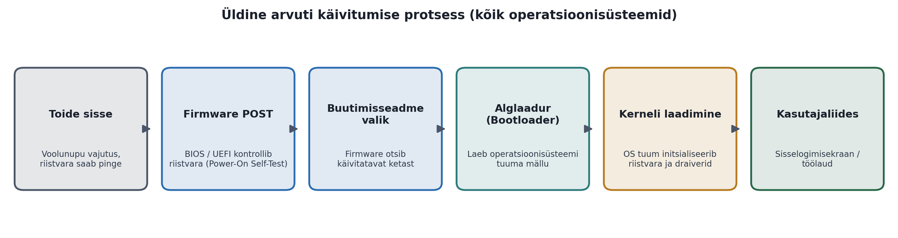
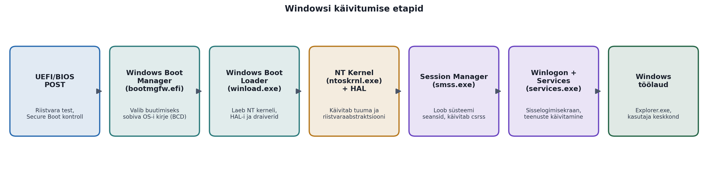
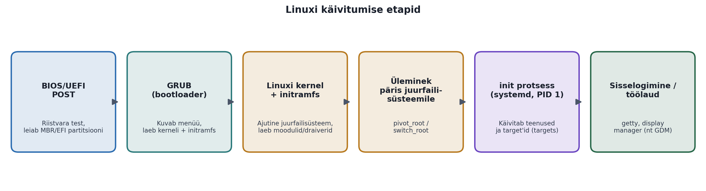
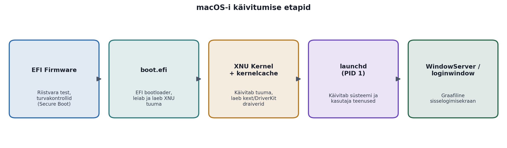

# Arvuti käivitumine ja operatsioonisüsteemi laadimine

### Windows, Linux ja macOS: mis toimub arvuti sisse lülitades

*Õppematerjal IT eriala esmakursuslasele*

Teemad: POST, BIOS/UEFI, alglaadurid, kerneli laadimine, Windows Boot Manager, GRUB, initramfs, systemd, launchd

---

## 1. Sissejuhatus

Iga kord, kui vajutad arvuti toitenuppu, käivitub taustal keeruline ja täpselt kooskõlastatud protsesside jada, mis mõne sekundi kuni minutiga viib sinu masina täiesti "tardunud" olekust töövalmis töölauani. Seda protsessi nimetatakse arvuti käivitumiseks ehk buutimiseks (inglise k. *booting*, tuletatud väljendist "pulling oneself up by one's bootstraps").

IT-spetsialisti jaoks on buutimisprotsessi mõistmine hädavajalik oskus — see aitab diagnoosida riistvara- ja tarkvaraprobleeme, mõista turvamehhanisme (nt Secure Boot), koostada dual-boot süsteeme, taastada rikutud operatsioonisüsteeme ning tegutseda kindlalt olukorras, kus arvuti "ei käivitu".

**Selles materjalis käsitleme:**

- mis toimub arvuti käivitamisel enne operatsioonisüsteemi laadimist ehk firmware (BIOS/UEFI) tasandil;
- kuidas alglaadur (bootloader) annab juhtimise üle operatsioonisüsteemi tuumale (kernel);
- milliste konkreetsete protsesside ja komponentide kaudu laetakse kernel ning käivitatakse süsteem Windowsis, Linuxis ja macOS-is;
- kesksete mõistete sõnastikku ning kontrollküsimusi omandatu kinnistamiseks.

> **Analoogia**
>
> *Mõtle buutimisprotsessile kui lennujaama käivitamisele hommikul: kõigepealt kontrollitakse turvasüsteeme ja seadmeid (POST), seejärel selgitatakse välja, kust lennud väljuvad (alglaadur leiab OS-i), lõpuks käivitatakse kõik teenistused — check-in, turvakontroll, kohvikud (kernel laeb teenused) — ning lõpuks avatakse uksed reisijatele (kasutaja näeb töölauda).*

---

## 2. Üldine buutimisprotsess — ühine kõigile operatsioonisüsteemidele

Olenemata sellest, kas arvutisse on paigaldatud Windows, Linux või macOS, läbivad kõik seadmed käivitumisel sisuliselt samad kõrgetasemelised etapid. Erinevused peituvad alles hilisemates, operatsioonisüsteemile spetsiifilistes sammudes.

*Joonis 1. Üldine arvuti käivitumise protsess, mis kehtib kõigi operatsioonisüsteemide puhul.*

### 2.1 Toite sisselülitamine ja POST

Kui vajutad toitenuppu, saab emaplaat (motherboard) esimesena pinge. Protsessori arhitektuur määrab kindla mäluaadressi (nn *reset vector*), millelt protsessor käskude täitmist alustab — see aadress ise on protsessori disaini sisse kõvasti kodeeritud (hardcoded) ja seda ei saa muuta. Kood, mis sellel aadressil tegelikult asub, ei ole aga protsessori sisse raiutud, vaid on salvestatud eraldi kiibile emaplaadil — see on püsivara (firmware) ehk BIOS/UEFI kood, mida on tegelikult võimalik ka uuendada (nn firmware-uuendus ehk "flashimine"), erinevalt aadressist endast.

> **Mõiste lähemalt: mida tähendab "hardcoded"?**
>
> *"Hardcoded" tähendab IT-s väärtust või käitumist, mis on jäädavalt fikseeritud kas füüsilisse riistvarasse endasse või programmikoodi sisse nii, et seda ei saa lihtsalt käigupealt muuta — muutmiseks tuleks valmistada uus kiip või kirjutada kood ümber ja see uuesti paigaldada. See on otseses vastanduses millegagi, mis on seadistatav (configurable) või uuendatav (updatable), st mida saab muuta ilma riistvara ennast asendamata.*
>
> *Analoogia: mõtle majale, mille peauks asub ehitusprojekti järgi alati täpselt samas kohas — see asukoht on maja ehitusse "kõvasti kodeeritud". Ust ei saa lihtsalt tarkvarauuendusega teise kohta "teleportida", vaid selleks tuleks maja päriselt ümber ehitada. Täpselt samamoodi on protsessori reset vector-i aadress juba kiibi valmistamise käigus tehases räni sisse jäädavalt "kirjutatud" (osa füüsilisest elektroonilisest skeemist) — seda ei saa hiljem tarkvaraga muuta.*
>
> *Firmware (BIOS/UEFI) on selles võrdluses aga pigem nagu maja sisustus: see paikneb spetsiaalses, korduvkirjutatavas kiibis nimega flash-mälu, mis on ehituselt disainitud nii, et selle sisu SAAB elektrooniliselt uuesti kirjutada (nn firmware'i "flashimine" ehk BIOS/UEFI uuendus), kuigi igapäevaselt jääb see sisu muutumatuks, kuni keegi teadlikult uuenduse paigaldab. Seega: reset vector-i aadress on riistvarasse raiutud ja jääv, samas kui sellel aadressil käivitatav BIOS/UEFI kood ise on tehniliselt uuendatav tarkvara, mis lihtsalt asub püsimälukiibil.*

Esimene firmware poolt tehtav toiming on POST (Power-On Self-Test) — riistvara enesetest. Selle käigus kontrollitakse, kas protsessor, mälu (RAM), klaviatuur ja muu põhiriistvara toimivad korrektselt.

**Näide:** kui arvuti RAM-pulk on halvasti pesas, ei jõua masin POST-i läbimiseni ning kostab tavaliselt iseloomulik piiksujada ("beep code") — see on firmware viis öelda "riistvaraviga", ilma et ekraanigi peaks tööle hakkama.

### 2.2 BIOS vs UEFI

Firmware, mis POST-i teostab, on ühte kahest tüübist:

- **BIOS** (Basic Input/Output System) — vanem, 1980ndatest pärinev standard. Töötab 16-bitises reaalrežiimis, kasutab kettalt käivitamiseks MBR-i (Master Boot Record) ning toetab kettaid kuni ~2 TB.
- **UEFI** (Unified Extensible Firmware Interface) — kaasaegne asendaja, mis toetab suuremaid kettaid (GPT partitsioonitabel), kiiremat käivitumist, graafilist kasutajaliidest ning turvafunktsiooni *Secure Boot*, mis kontrollib digiallkirjade abil, et laetav operatsioonisüsteem pole pahavaraga rikutud.

Enamik tänapäevaseid arvuteid kasutab UEFI-t, sageli BIOS-iga ühilduvuse režiimis ("CSM" ehk Compatibility Support Module) vanemate süsteemide jaoks.

### 2.3 Buutimisseadme valik (Boot Device Selection)

Kui riistvara test on läbitud, otsib firmware kettaseadme, millel asub käivitatav kood. See järjekord (boot order) on kasutaja poolt firmware seadistuses (nt vajutades käivitumisel klahvi F2, F12, Del või Esc) määratav — näiteks kõigepealt USB-mälupulk, seejärel SSD.

### 2.4 Alglaadur (Bootloader)

Kui sobiv seade on leitud, laeb firmware mällu väikese programmi — alglaaduri. Alglaaduri ainus ülesanne on leida operatsioonisüsteemi tuum kettalt, laadida see mällu ning anda talle juhtimine üle. Levinumad alglaadurid on Windows Boot Manager (Windowsis), GRUB (enamikus Linuxi distributsioonides) ja boot.efi (macOS-is) — neid käsitleme põhjalikumalt järgmistes peatükkides.

### 2.5 Kerneli laadimine ja üleminek kasutajaliidesele

Alglaadur annab juhtimise operatsioonisüsteemi tuumale (kernel), mis on OS-i "süda" — see haldab protsessorit, mälu, sisend-väljundseadmeid ja protsesse. Kernel initsialiseerib riistvaradraiverid, käivitab esimese kasutajaruumi protsessi (Windowsis smss.exe, Linuxis/macOS-is init või systemd/launchd, PID 1) ning selle kaudu käivituvad järk-järgult kõik ülejäänud süsteemiteenused, kuni lõpuks kuvatakse sisselogimisekraan või töölaud.

---

## 3. Windowsi käivitumisprotsess

Windowsi buutimisprotsess koosneb mitmest selgelt eristatavast etapist, mis on aastate jooksul (eriti UEFI ja Secure Booti tulekuga) muutunud oluliselt turvalisemaks ja kiiremaks kui vana BIOS-põhine käivitus.

*Joonis 2. Windowsi käivitumise etapid firmware POST-ist töölauani.*

### 3.1 UEFI POST ja Secure Boot

Nagu eelnevalt kirjeldatud, teostab firmware kõigepealt POST-i. Kaasaegsetel Windowsi masinatel kontrollib UEFI ka Secure Boot mehhanismi abil, et järgnevalt laetav kood (bootloader) on Microsofti või seadme tootja poolt digitaalselt allkirjastatud — see takistab nn bootkit tüüpi pahavara, mis üritaks end sisse suruda enne operatsioonisüsteemi enda turvamehhanisme.

> **Mõiste lähemalt: bootkit vs rootkit**
>
> *Bootkit on rootkiti alaliik — rootkit on üldnimetus pahavarale, mis peidab oma kohalolekut süsteemis ja hangib endale kõrgeimad õigused. Bootkit on spetsiifiliselt suunatud käivitusprotsessi (MBR, VBR ehk Volume Boot Record, või UEFI firmware) nakatamisele. Kuna bootkit käivitub juba enne operatsioonisüsteemi ennast ja enne viirusetõrjet, saab ta end tõhusalt peita ning omandada kerneli-tasemel õigused juba enne, kui ükski kaitsemehhanism jõuab tööle hakata.*
>
> *Ajalooliselt olid tuntumad näited 2005. aasta kontseptsioon "BootRoot", 2009. aastal levinud "Stoned Bootkit" ning eriti ohtlik TDL4 (tuntud ka kui "Alureon"), mis aastatel 2010–2011 nakatas miljoneid arvuteid ja lülitas need suurde robotvõrku (botnet). Just selliste rünnakute tõttu töötatigi UEFI raames välja Secure Boot: see nõuab, et iga käivitusetapi kood oleks usaldusväärse osapoole poolt digitaalselt allkirjastatud, mistõttu allkirjastamata bootkit-koodi enam ei laadita.*

### 3.2 Windows Boot Manager (bootmgfw.efi)

Firmware laeb EFI süsteemipartitsioonilt faili `\EFI\Microsoft\Boot\bootmgfw.efi` — see on Windows Boot Manager. Tema ülesanne on lugeda BCD-andmebaasi (Boot Configuration Data), mis sisaldab infot selle kohta, milliseid operatsioonisüsteeme masinasse paigaldatud on (nt dual-boot korral mitu Windowsi versiooni) ning kuvab vajadusel valikumenüü.

### 3.3 Windows Boot Loader (winload.exe)

Kui operatsioonisüsteemi kirje on valitud, käivitab Boot Manager faili winload.exe. See omakorda:

- laeb mällu NT kerneli (ntoskrnl.exe) ja riistvara abstraktsioonikihi (HAL — Hardware Abstraction Layer);
- laeb süsteemiregistri tuuma osa (SYSTEM hive) ning boot-kriitilised draiverid (nt kettakontrolleri draiver, ilma milleta kernel ei pääseks ligi failisüsteemile);
- kontrollib Secure Boot ja ELAM (Early Launch Anti-Malware) abil, et laaditavad draiverid on usaldusväärsed.

> **Mõiste lähemalt: registry hive**
>
> *Windowsi register (Windows Registry) on hierarhiline andmebaas, kuhu on salvestatud operatsioonisüsteemi, riistvara ja rakenduste seadistused. Registri sisu ei asu ühes failis, vaid on jaotatud mitmeks suuremaks, iseseisvaks binaarfailiks, mida nimetatakse inglise keeles hive'ideks (sõna-sõnalt "mesipuu" — nimetus tuleneb sellest, et registri sisemine hargnev, sektsioonideks jaotatud struktuur meenutas selle loojatele mesilastaru kärgi). SYSTEM hive on üks neist põhifailidest ning sisaldab just neid seadistusi (nt millised draiverid ja teenused peavad käivituma ning millises järjekorras), mida on tingimata vaja juba käivitumise väga varajases faasis, enne kui suurem osa operatsioonisüsteemist on üldse laetud. Failina asub see kettal asukohas `C:\Windows\System32\config\SYSTEM`.*

### 3.4 NT Kernel ja HAL

Enne kui vaatame ntoskrnl.exe konkreetseid ülesandeid, tasub meelde tuletada, mis on kernel (tuum) üldiselt. Kernel on operatsioonisüsteemi kõige madalamal tasemel töötav tarkvarakiht, millel on riistvara peale otsene ja piiramatu ligipääs. Tavalised rakendused (brauser, tekstiredaktor, mänguprogramm) ei tohi turvalisuse ja süsteemi stabiilsuse huvides riistvaraga kunagi otse suhelda — kui nad tahavad näiteks faili kettale kirjutada või mälu juurde küsida, peavad nad esitama kernelile päringu, mida nimetatakse süsteemikutseks (system call). Kernel otsustab, kas ja millal seda teha, ning koordineerib kõiki samaaegselt töötavaid protsesse nii, et need üksteist ei segaks ega kogu süsteemi kokku ei jookseks.

Windowsis kannab seda kerneli rolli fail ntoskrnl.exe. Käivitumise käigus initsialiseerib see muu hulgas:

- mälu haldamise (memory management) — jagab füüsilise ja virtuaalse mälu eri protsesside vahel ning hoolitseb, et üks protsess ei kirjutaks kogemata teise protsessi mällu;
- protsesside ajastamise (scheduler) — otsustab, milline protsess millal ja kui kaua protsessorituuma aega saab, mistõttu tundub kasutajale, et kümned programmid töötavad "samaaegselt";
- turvaalamsüsteemi (security subsystem) — kontrollib kasutajakontode õigusi ja ligipääsuluba ressurssidele;
- ning laeb ülejäänud, vähem kriitilised draiverid vastavalt nende käivitustüübile.

HAL (Hardware Abstraction Layer) on omaette tarkvarakiht, mis jääb kerneli ja füüsilise riistvara vahele. Tema ülesanne on "tõlkida" kerneli üldised, riistvarast sõltumatud käsud (nt "katkesta hetkeks protsessori töö" ehk interrupt, või "loe andmeid mälust") iga konkreetse emaplaadi ja kiibistiku jaoks täpselt sobivasse madala taseme käsuvormingusse. Ilma selle vahekihita peaks Microsoft kirjutama ja hooldama täiesti eraldi kerneliversiooni iga võimaliku riistvarakombinatsiooni jaoks. Tänu HAL-ile piisab ühestainsast ühisest kernelist (ntoskrnl.exe), mis suhtleb alati sama, ühtse liidese kaudu — riistvara-spetsiifiliste erinevustega tegeleb juba HAL ise.

> **Analoogia: HAL kui tõlk**
>
> *Mõtle HAL-ile kui tõlgile rahvusvahelisel konverentsil. Peaesineja (kernel) räägib alati üht kindlat keelt ja ei pea teadma, kas saalis istuvad prantslased, sakslased või jaapanlased (erinev riistvara) — tõlk (HAL) vahendab tema sõnumi reaalajas igaühe emakeelde. Kui konverents toimub järgmisel aastal teises riigis teise publikuga (uus arvuti, uus riistvara), ei pea esineja oma kõnet ümber kirjutama — piisab, kui kohale tuuakse uus, selle publiku keelt oskav tõlk (uuendatud HAL). Just tänu sellele töötab sama Windowsi tuum enam-vähem muutmata kujul väga erineva riistvaraga arvutites.*

### 3.5 Session Manager, Winlogon ja teenused

Kui tuum on käivitunud, käivitatakse esimene kasutajaruumi protsess — Session Manager Subsystem (smss.exe). See loob süsteemisessiooni, käivitab csrss.exe (Client/Server Runtime Subsystem) ning seejärel wininit.exe, mis omakorda käivitab:

- services.exe — Service Control Manager, mis käivitab kõik automaatkäivitusega Windowsi teenused (nt võrguteenused, printeriteenused);
- lsass.exe — Local Security Authority, mis vastutab autentimise eest;
- winlogon.exe — kuvab sisselogimisekraani ja haldab kasutaja sessiooni.

Pärast edukat sisselogimist käivitub explorer.exe, mis kuvab tuttava Windowsi töölaua ja tegumiriba.

### 3.6 Windows 11 uued turvanõuded: TPM 2.0, Secure Boot ja riistvaraline juurturvalisus

Windows 11 tõi kaasa hulga senisest oluliselt rangemaid riistvaranõudeid, mis kõik on otseselt seotud käesolevas peatükis kirjeldatud käivitusprotsessiga — Microsofti eesmärk oli, et arvuti turvalisus algaks juba enne operatsioonisüsteemi laadimist, mitte alles pärast seda. Kaks kesksemat uut nõuet on TPM 2.0 ja kohustuslik UEFI Secure Boot.

#### TPM (Trusted Platform Module) 2.0

TPM on eraldiseisev, väike turvakiip emaplaadil (kaasaegsematel süsteemidel sageli osa protsessori enda kiibistikust), mille ülesanne on turvaliselt hoida krüptovõtmeid, paroole ja sertifikaate keskkonnas, mis on operatsioonisüsteemist endast täielikult eraldatud. Isegi kui pahavara peaks operatsioonisüsteemi nakatama, ei pääse see TPM-i sisemuses hoitavatele saladustele ligi, kuna TPM-il on omaenda, muust süsteemist isoleeritud protsessor ja mälu.

Microsoft nõuab Windows 11 jaoks konkreetselt versiooni TPM 2.0 (vanem TPM 1.2 enam ei sobi) mitmel omavahel seotud põhjusel:

- **BitLocker** — Windowsi kettakrüpteerimisfunktsioon hoiab krüptovõtit TPM-i riistvaras, mitte tavalisel kettal, mistõttu andmete lugemine varastatud kõvakettalt eraldi (ilma algse arvutita) muutub praktiliselt võimatuks;
- **Windows Hello** — näo- või sõrmejälje-põhine sisselogimine salvestab biomeetrilised viited TPM-i, mitte tavalisele failisüsteemile;
- **Käivituse mõõtmine (measured boot)** — TPM salvestab iga käivitusetapi kohta krüptograafilise "sõrmejälje" (räsi), mille põhjal saab hiljem kontrollida (nn attestation), et käivitusahelat pole vahepeal muudetud;
- **Credential Guard** — isoleerib kasutaja sisselogimisandmed (nt domeeni paroolihašid) omaette turvatud keskkonda, kuhu pahavaral ligipääsu ei ole.

> **Analoogia: TPM kui hoone sisse valatud seif**
>
> *Kui operatsioonisüsteem oleks maja, siis tavaline kasutajaparool oleks lihtsalt ukselukk. TPM on aga nagu panga hoidla-seif, mis on juba ehitusfaasis hoone vundamendi sisse valatud. Isegi kui keegi tungib majja sisse (nakatab operatsioonisüsteemi pahavaraga), ei pääse ta seifi sisu (krüptovõtmete) juurde — seif on eraldiseisev, omaenda lukumehhanismiga üksus, mis ei allu maja tavapärastele (operatsioonisüsteemi tasemel toimivatele) reeglitele ega ukselukkudele.*

#### Secure Boot — nüüd kohustuslik, mitte valikuline

Secure Boot mehhanism ise (vt ptk 2.2) eksisteeris juba varasemates Windowsi versioonides, kuid Windows 10 puhul oli see pigem soovituslik lisavõimalus. Windows 11 nõuab installeerimiseks otseselt, et Secure Boot oleks UEFI-s sisse lülitatud — see on ka üks peamisi põhjuseid, miks vanemate, ainult BIOS-i toega (ilma UEFI-ta) arvutite peale ei saa Windows 11 ametlikult paigaldada.

#### VBS ja HVCI — virtualiseerimisel põhinev turve

Windows 11 kasutab lisaks nn virtualiseerimisel põhinevat turvet (Virtualization-Based Security, VBS, kasutajaliideses tuntud ka kui "tuuma eraldamine"/Core Isolation). VBS kasutab protsessori riistvaralist virtualiseerimistuge — sama tehnoloogiat, mida kasutavad virtuaalmasinad —, et luua operatsioonisüsteemi enda sees eraldi, isoleeritud "turvatuum" (secure kernel). Isegi kui tavaline Windowsi tuum peaks olema pahavara poolt kompromiteeritud, jääb see isoleeritud osa kaitstuks. Üks VBS-i osa on HVCI (Hypervisor-protected Code Integrity, kasutajaliideses "Mälu terviklikkus"/Memory Integrity), mis kontrollib, et kernelisse laaditav kood (nt draiverid) oleks usaldusväärne ja digitaalselt allkirjastatud — see takistab just draiveri kaudu süsteemi tunginud pahavaral kerneli tasemel tegutsemast.

#### Microsoft Pluton

Osadel uuematel protsessoritel (nii AMD, Inteli kui Qualcommi kiipidel) on Microsoft koostöös kiibitootjatega integreerinud turvafunktsioonid otse protsessori enda kiibistikku — seda arhitektuuri nimetatakse Microsoft Plutoniks. Erinevalt eraldiseisvast TPM-kiibist, mille ja protsessori vahelist andmesidet on teoreetiliselt võimalik füüsiliselt pealt kuulata või kiipi emaplaadilt eemaldada, on Pluton osa protsessori enda räni struktuurist, mis muudab sellised füüsilised ründed märkimisväärselt keerulisemaks.

Kokkuvõttes: kõik need Windows 11 nõuded — TPM 2.0, kohustuslik Secure Boot, VBS/HVCI ja (osadel masinatel) Pluton — moodustavad üheskoos nn riistvaralise juurturvalisuse (hardware root of trust), mille eesmärk on tagada, et usalduse ahel algaks juba riistvara tasemel ning oleks katkematu läbi kogu käesolevas peatükis kirjeldatud käivitusprotsessi — firmware'ist kuni töölauani.

---

## 4. Linuxi käivitumisprotsess

Linuxi buutimisprotsess on modulaarsem ja avatuma arhitektuuriga kui Windowsis — erinevad distributsioonid (Ubuntu, Fedora, Debian jt) võivad kasutada erinevaid alglaadureid ja init-süsteeme, kuid valdav enamus tänapäeva distributsioonidest järgib alljärgnevat mustrit.

*Joonis 3. Linuxi käivitumise etapid firmware POST-ist sisselogimiseni.*

### 4.1 GRUB (GRand Unified Bootloader)

Enamikus Linuxi distributsioonides on vaikimisi alglaaduriks GRUB2. Firmware (BIOS või UEFI) laeb GRUB-i esimese etapi koodi, mis omakorda laeb GRUB-i põhikonfiguratsiooni (tavaliselt failist `/boot/grub/grub.cfg`) ja kuvab kasutajale menüü operatsioonisüsteemi ja kerneli versiooni valimiseks. GRUB laeb valitud Linuxi kerneli (nt `/boot/vmlinuz-6.8.0`) ning sellega seotud initramfs-kujutise mällu.

### 4.2 Kernel ja initramfs

Linuxi kernel käivitub esmalt väga minimaalses, ajutises failisüsteemis nimega initramfs (Initial RAM File System) — see on mällu laetud pakitud arhiiv, mis sisaldab hädavajalikke draivereid ja tööriistu (nt kettakontrolleri, RAID-i või krüpteeritud kettapartitsiooni draiverid), mida on vaja päris juurfailisüsteemi (root filesystem) leidmiseks ja külge haakimiseks.

**Näide:** kui su juurpartitsioon on LUKS-krüpteeritud, siis just initramfs-i etapis küsitakse sinu käest krüpteerimise parooli — päris kernel ise ei tea veel krüptovõtmetest midagi.

### 4.3 Üleminek päris juurfailisüsteemile

Kui õige ketaspartitsioon on leitud ja külge haagitud, teostab kernel käsu switch_root (varem kasutati pivot_root), mis "vahetab" ajutise initramfs-i juurfailisüsteemi vastu päris kettal asuva juurfailisüsteemi vastu ning käivitab sealt esimese päris protsessi.

### 4.4 init protsess — systemd (PID 1)

Esimene protsess, mille PID (protsessi identifikaator) on alati 1, on init-süsteem. Enamikus tänapäeva distributsioonides (Ubuntu, Fedora, Debian, RHEL, openSUSE) on selleks systemd, mis asendas varasema, lineaarsema SysV init-süsteemi. systemd käivitab teenuseid paralleelselt, sõltuvuste graafi (dependency graph) alusel, mis kiirendab käivitumist oluliselt võrreldes vanade süsteemidega.

systemd organiseerib käivitusseisundid nn target-iteks (varasema "runlevel" mõiste vaste), näiteks:

- `multi-user.target` — mitme kasutaja režiim ilma graafilise liideseta (nt serverites);
- `graphical.target` — graafiline töölaud koos display manager'iga (nt GDM, SDDM);
- `rescue.target` / `emergency.target` — minimaalsed taastamisrežiimid tõrkeotsinguks.

### 4.5 Sisselogimine

Kui vajalik target on saavutatud, käivitub kas tekstipõhine sisselogimisviip (getty, tavaliselt virtuaalkonsoolil) või graafiline sisselogimishaldur (display manager), mis kuvab kasutajale sisselogimisakna ning pärast autentimist käivitab töölauakeskkonna (nt GNOME, KDE Plasma).

---

## 5. macOS-i käivitumisprotsess

macOS töötab ainult Apple'i enda riistvaral ning kasutab kohandatud EFI-põhist käivitusahelat, mis on tihedalt integreeritud riistvaralise turvakontrolleriga (Apple T2 kiip Intel-Macidel või otse Apple Silicon SoC-i turvaelemendid uuematel M-seeria masinatel).

*Joonis 4. macOS-i käivitumise etapid firmware'ist sisselogimiseni.*

### 5.1 EFI Firmware ja turvakontroll

Toite sisselülitamisel teostab Mac'i EFI-põhine firmware riistvara enesetesti ning — tänu tihedale seosele Apple'i riistvaraga — kontrollib kohe ka käivitusahela usaldusväärsust (Secure Boot mudel, mis Apple Silicon Macides on veelgi rangem kui tavaline UEFI Secure Boot, kontrollides krüptograafiliselt iga käivitusetapi allkirja alates riistvarast endast).

### 5.2 boot.efi

Firmware laeb EFI süsteemipartitsioonilt boot.efi — Apple'i enda EFI-bootloaderi. See leiab kettalt sobiva macOS-i installatsiooni (APFS - Apple File System - köitegrupist), kontrollib selle tervikluse allkirju ning laeb mällu operatsioonisüsteemi tuuma.

### 5.3 XNU kernel ja kernelcache

macOS-i tuum kannab nime XNU ("X is Not Unix") — see on hübriidkernel, mis ühendab endas Mach-mikrokerneli (protsesside ja mälu haldamiseks) ning BSD-kihi (Unixiga ühilduvad POSIX-süsteemikutsed). Kiiremaks käivitumiseks kasutab macOS eellaaditud kernelcache'i — kernel ja enamik vajalikke draivereid (kext-id või uuemad DriverKit draiverid) on juba eelnevalt kokku pakitud ühte kujutisfaili, mistõttu pole vaja igal käivitumisel eraldi kümneid draiverifaile otsida ja laadida.

### 5.4 launchd (PID 1)

Nagu Linuxi systemd, on ka macOS-is esimene kasutajaruumi protsess (PID 1) nimega launchd. See vastutab kõigi süsteemi- ja kasutajateenuste (nn "daemons" ja "agents") käivitamise, jälgimise ja vajadusel taaskäivitamise eest, lähtudes deklaratiivsetest .plist konfiguratsioonifailidest kataloogides nagu `/System/Library/LaunchDaemons`.

### 5.5 WindowServer ja loginwindow

launchd käivitab WindowServeri (graafika renderdamise ja akende haldamise süsteemi) ning loginwindow protsessi, mis kuvab kasutajale tuttava macOS-i sisselogimisekraani. Pärast autentimist käivitatakse kasutaja Dock, Finder ja muud töölauakomponendid.

---

## 6. Kolme operatsioonisüsteemi kõrvutus

Alljärgnev tabel võtab kokku kolme käsitletud operatsioonisüsteemi käivitumisprotsessi kesksed komponendid, et aidata näha nende sarnasusi ja erinevusi.

| Etapp | Windows | Linux | macOS |
|---|---|---|---|
| Firmware | UEFI (Secure Boot) | BIOS / UEFI | EFI + T2/Apple Silicon turvaelement |
| Alglaadur | Windows Boot Manager (bootmgfw.efi) | GRUB2 (tavaliselt) | boot.efi |
| Kerneli laadimine | winload.exe → ntoskrnl.exe + HAL | GRUB → kernel + initramfs → switch_root | boot.efi → XNU kernel (kernelcache) |
| Esimene protsess (PID 1) | smss.exe | systemd (enamasti) | launchd |
| Teenuste haldus | Service Control Manager (services.exe) | systemd units / target'id | launchd daemons / agents (.plist) |
| Sisselogimisekraan | winlogon.exe | Display manager (nt GDM, SDDM) | loginwindow |

---

## 7. Kokkuvõte

Kuigi Windows, Linux ja macOS näivad kasutajaliidese tasandil väga erinevad, järgivad kõik kolm sama põhilist käivitusloogikat: riistvara enesetest (POST) → firmware valib buutimisseadme → alglaadur leiab ja laeb operatsioonisüsteemi tuuma → tuum initsialiseerib riistvara ja käivitab esimese kasutajaruumi protsessi → see protsess käivitab järjest ülejäänud teenused ja lõpuks kasutajaliidese.

Erinevused peituvad peamiselt konkreetsetes komponentides ja failinimedes (nt winload.exe vs GRUB vs boot.efi) ning selles, kuivõrd modulaarne ja avatud on süsteemi arhitektuur — Linux pakub siin kõige suuremat paindlikkust ja läbipaistvust, Windows ja macOS aga tihedamalt integreeritud ja suletumat, kuid sageli kasutajasõbralikumat ning riistvaraga tihedamalt seotud lahendust.

> **Meelespea**
>
> *Kui arvuti käivitumisel tekib tõrge, mõtle alati, millises etapis probleem tekkis: kas ekraan jääb tühjaks juba POST-i ajal (riistvaraviga), kas alglaaduri menüü ei leia operatsioonisüsteemi (bootloader/partitsiooni probleem), või jõuab masin kerneli laadimiseni, kuid jookseb siis kinni (draiveri- või tuumaviga). See loogiline jaotus aitab probleemi kiiresti kitsendada.*

---

## 8. Mõistete sõnastik

**POST (Power-On Self-Test)** — firmware teostatav riistvara enesetest kohe pärast toite sisselülitamist.

**BIOS (Basic Input/Output System)** — vanem firmware-standard, mis töötab 16-bitises reaalrežiimis ja kasutab MBR-partitsioonitabelit.

**UEFI (Unified Extensible Firmware Interface)** — kaasaegne firmware-standard, mis toetab GPT-partitsioone, Secure Bootist ja kiiremat käivitumist.

**Secure Boot** — turvamehhanism, mis lubab käivituda ainult digitaalselt allkirjastatud, usaldusväärsel koodil.

**Bootloader (alglaadur)** — väike programm, mille ülesanne on leida ja laadida mällu operatsioonisüsteemi tuum.

**Kernel (tuum)** — operatsioonisüsteemi tuumkomponent, mis haldab protsessorit, mälu, seadmeid ja protsesse.

**HAL (Hardware Abstraction Layer)** — Windowsis kerneli ja füüsilise riistvara vahel olev kiht, mis peidab riistvara-spetsiifilised erinevused.

**BCD (Boot Configuration Data)** — Windowsi andmebaas, mis kirjeldab käivitusvõimalusi (nt eri operatsioonisüsteemide kirjeid).

**initramfs** — Linuxi kerneli poolt käivitumise alguses kasutatav ajutine, mällu laetud minimaalne failisüsteem.

**PID 1** — esimese kasutajaruumi protsessi identifikaator, millest "pärinevad" kõik teised süsteemi protsessid (systemd, launchd, smss.exe roll).

**systemd** — enamiku tänapäeva Linuxi distributsioonide init- ja teenustehaldussüsteem.

**launchd** — macOS-i esimene protsess ja teenustehaldur.

**Target (systemd) / Runlevel** — kindel süsteemi käivitusseisund (nt tekstipõhine vs graafiline režiim).

**XNU** — macOS-i hübriidkernel (Mach-mikrokernel + BSD-kiht).

**Kernelcache** — macOS-i eelnevalt kokkupakitud kernel + draiverid, mis kiirendab käivitumist.

**Dual boot** — seadistus, kus ühes arvutis on paigaldatud kaks või enam operatsioonisüsteemi ning kasutaja valib käivitumisel, millist kasutada.

---

## 9. Kontrollküsimused ja harjutused

Kasuta neid küsimusi, et kontrollida, kas oled peamised mõisted omandanud. Proovi vastata ilma materjali vaatamata ning kontrolli seejärel üle.

- Milline on peamine erinevus BIOS-i ja UEFI vahel ning miks on Secure Boot turvalisuse seisukohalt oluline?
- Kirjelda oma sõnadega, mis on POST ja mis juhtub, kui see läbi ei lähe.
- Milline fail on Windowsis vastutav operatsioonisüsteemi valikumenüü kuvamise eest ja milline fail laeb selle järel NT kerneli?
- Miks vajab Linuxi kernel käivitumise alguses ajutist initramfs-i, mitte ei mine kohe otse päris juurfailisüsteemi?
- Mis on ühist Linuxi systemd-l ja macOS-i launchd-l? Too välja vähemalt kaks sarnasust ja üks erinevus.
- Milline protsess saab alati PID väärtuse 1 ning miks on see protsess süsteemi jaoks nii oluline?
- Millise etapiga (POST, bootloader või kernel/draiver) seostuksid järgmised sümptomid: (a) arvuti ei anna pilti ega piiksugi; (b) kuvatakse "Operating System not found"; (c) arvuti jookseb kinni kohe pärast tootja logo, enne sisselogimisekraani ilmumist?
