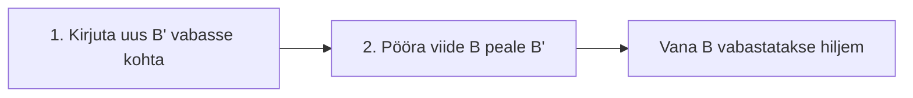

# Failisüsteemid: õppematerjal IT-tudengitele

*Operatsioonisüsteemide aine · esimese aasta tudengid · eelteadmisi riistvarast ei eeldata*

---

## 1. Miks on failisüsteemi üldse vaja?

Kujuta ette hiiglaslikku raamatukogu, kus on miljoneid tühje riiulikohti, aga puudub kataloog, riiulinumbrid ja laenutuskaardid. Raamatu sisse toomine oleks lihtne, leidmine võimatu.

Kõvaketas, SSD või mälupulk on täpselt selline: lihtsalt pikk jada ühesuuruseid plokke. Ketas ei tea, mis on fail, mis on kaust ega kus üks fail lõpeb. **Failisüsteem** on reeglistik ja andmestruktuur, mis annab ketta sisule mõtte. See:

- seob failinime konkreetsete ketta plokkidega,
- korraldab failid kaustade hierarhiasse,
- hoiab **metaandmeid** (suurus, ajad, omanik, õigused),
- peab arvet, millised plokid on vabad ja millised kasutuses,
- tagab, et kaks faili ei kirjuta üksteise peale.

Tänu sellele saad kirjutada `C:\Dokumendid\cv.docx`, mitte "kirjuta plokid 8 412 000–8 412 017".

## 2. Klaster: ruumi jaotamise ühik

**Klaster** (ext4-s *block*) on väikseim ruumiühik, mille failisüsteem failile eraldab, tavaliselt 4 KB. Kujuta ette kappi, kus on ainult 4-liitrised kastid: 1 liitri riiete jaoks võtad ikkagi terve kasti.

| Faili suurus | Klastreid | Tegelik ruumikulu | Raisatud |
| --- | --- | --- | --- |
| 1 KB | 1 | 4 KB | 3 KB |
| 4 KB | 1 | 4 KB | 0 KB |
| 5 KB | 2 | 8 KB | 3 KB |

Seda raisatud ruumi nimetatakse **sisemiseks fragmentatsiooniks** (*slack space*). Kui kaustas on 100 000 pisikest logifaili, võib raisk ulatuda gigabaitideni.

Klastri suuruse valik on kompromiss: suur klaster (nt 32 KB) sobib video ja suurte failide jaoks, väike (4 KB) säästab ruumi väikeste failide puhul. Sellest tuleb eraldi eristada **välimine fragmentatsioon**: fail on killustunud mitmesse kohta kettal. Pöörleval kettal (HDD) aeglustab see lugemist, SSD-l on mõju väike.

## 3. Žurnaliseerimine: kaitse voolukatkestuse vastu

Kolid ühest korterist teise ja kirjutad vihikusse: "Plaan: tõstan kapi A tuppa B." Kui vool kaob keset tõstmist, vaatad vihikust, mis pooleli jäi, ja lõpetad või tühistad selle. **Žurnal** (*journal*) on failisüsteemi vihik: enne muudatust kirjutatakse sinna, mida kavatsetakse teha.

Ilma žurnalita võib failisüsteem jääda vastuoluliseks (fail on kataloogis, aga selle plokid on märgitud vabaks). Vanasti pidi OS käivitama `fsck` või `chkdsk`, mis skaneeris terve ketta läbi, suurel kettal tunde. Žurnaliga kontrollitakse ainult viimaseid kirjeid, mis võtab sekundeid.

**Oluline nüanss:** enamasti žurnaliseeritakse ainult **metaandmeid**. Failisüsteemi struktuur jääb terviklikuks, aga faili enda sisu võib poolikuks jääda. Žurnal kaitseb struktuuri, mitte tingimata sinu andmeid. Seepärast on olemas varukoopiad.

## 4. Copy-on-write: teine viis terviklikkuse tagamiseks

Žurnal on üks lahendus. Teine, uuem lahendus on **copy-on-write (COW)**, "kopeeri enne kirjutamist". Olemasolevat plokki ei kirjutata üle, vaid muudetud versioon kirjutatakse **uude vabasse kohta** ja alles seejärel uuendatakse viide.

Tavalisel ülekirjutamisel (nt FAT32) kirjutatakse plokk B kohapeal üle. Kui vool kaob keset kirjutamist, on B pooleldi vana ja pooleldi uus ning fail on rikutud. COW töötab kahes sammus:



1. Uus versioon B′ kirjutatakse vabasse kohta. Vana B ja kõik muu jäävad puutumata.
2. Failitabelis muudetakse viide B pealt B′ peale. See on üks väike, kiire ja "kõik või mitte midagi" tüüpi operatsioon.

Kui vool kaob enne teist sammu, osutab viide vanale B-le, fail on terviklik, lihtsalt vana versiooniga. Kui vool kaob pärast teist sammu, on uus versioon juba kehtiv. **Poolikut olekut ei teki.**

### Hetktõmmised ja kloonid

COW-i suur boonus: vana B ei kao kohe. Kui keegi seda veel vajab, saab selle alles hoida. **Hetktõmmis** (*snapshot*) on lihtsalt teine viidete komplekt samadele plokkidele. Selle loomine võtab sekundi murdosa ja esialgu praktiliselt null lisaruumi. Ruumi kulub alles siis, kui andmeid muudetakse, ja ainult muudetud plokkide jagu. **Klooni** puhul on põhimõte sama: 10 GB faili kopeerimine APFS-is ei kopeeri andmeid, enne kui üht koopiat muudetakse.

### COW-i miinused

- Muudatused paiskuvad üle ketta laiali, mis suurendab fragmentatsiooni (SSD-l ei ole see probleem).
- Vana ruumi vabastamine on keerulisem, sest tuleb teada, kas keegi seda veel kasutab.
- Kirjutamisel tekib mõnevõrra rohkem lisatööd (*write amplification*).

## 5. Neli failisüsteemi lähemalt

### FAT32 ja exFAT: lihtsus ja ühilduvus

**FAT** (*File Allocation Table*): ketta alguses on tabel, kus iga klastri kohta on kirje "järgmine klaster selles failis on X". Fail on seega lingitud loend. Töötab peaaegu kõikjal (telerid, kaamerad, konsoolid), aga FAT32-s on failisuuruse piir 4 GB ning puuduvad õigused, žurnal ja krüpteerimine. **exFAT** kaotab suuruspiirangu ja sobib mälukaartidele ning välisketastele, õigusi ja žurnalit sellel siiski pole.

### NTFS: Windowsi serverikeskkonna alus

NTFS-i keskmes on **MFT (Master File Table)**: iga fail ja kaust on seal üks kirje, mis sisaldab metaandmeid. Väikese faili sisu võib mahtuda otse MFT-kirjesse (*resident*). Võimalused:

- **ACL-id**: detailsed õigused kasutajate ja gruppide kaupa (Active Directory failiserveri alus),
- **žurnal** metaandmete kaitseks,
- **varjukoopiad (VSS)**, mis annavad "Previous Versions" ja varukoopiate aluse,
- kvoodid, tihendamine, EFS-krüpteerimine, **alternatiivsed andmevood (ADS)** ja hardlink'id.

Serverites on veel **ReFS**, Microsofti COW-põhine failisüsteem Hyper-V ja Storage Spaces jaoks.

### ext4: Linuxi standard

ext4 jagab ketta plokigruppideks ja iga faili kohta on **inode**, mis sisaldab metaandmeid ja viiteid plokkidele, aga **mitte failinime**. Nimi on kataloogis, mis seob nime inode'iga, seetõttu võib ühel failil olla mitu nime (*hard link*). Eripärad:

- **extents**: üks kirje kirjeldab pikka pidevat plokkide rida, mitte iga plokki eraldi,
- **žurnal** kolmes režiimis (`journal`, `ordered` vaikimisi, `writeback`),
- **viivitatud eraldamine** (*delayed allocation*) aitab leida pidevaid plokke,
- POSIX-õigused (rwx), vajadusel ACL-id.

Kui Linuxis on vaja COW-i ja hetktõmmiseid, kasutatakse **Btrfs**-i või **ZFS**-i.

### APFS: SSD-ajastu failisüsteem

APFS (Apple File System, 2017) asendas HFS+ ja on optimeeritud flash-mälule. Põhiomadused: **COW** (ei vaja klassikalist žurnalit), **hetktõmmised ja kloonid** (Time Machine ja macOS-i uuendused tuginevad neile), **konteinerid ja mahud**, mis jagavad vaba ruumi dünaamiliselt, ning krüpteerimine faili- ja mahutasemel (FileVault).

## 6. Võrdlus ühe pilguga

| Omadus | FAT32 / exFAT | NTFS | ext4 | APFS |
| --- | --- | --- | --- | --- |
| Krahhikindlus | puudub | žurnal | žurnal | copy-on-write |
| Hetktõmmised | ei | jah (VSS) | ei (Btrfs/ZFS-is jah) | jah |
| Õigused | ei | ACL | POSIX + ACL | jah |
| Põhistruktuur | FAT-tabel | MFT | inode'id | COW-puu |
| Parim kasutus | vahetatavad seadmed | Windows, serverid | Linux | Apple'i seadmed |

## 7. Praktiline osa: labor (90 min, paaristöö)

Kõik tehakse **virtuaalmasinas** ja testkettal. Ära vorminda päris ketast.

**A. Linux ja ext4 (25 min)**

```bash
dd if=/dev/zero of=ext4.img bs=1M count=64
mkfs.ext4 -b 4096 ext4.img
sudo mkdir -p /mnt/ext4 && sudo mount -o loop ext4.img /mnt/ext4
sudo chown $USER /mnt/ext4 && cd /mnt/ext4

echo "x" > vaike.txt
stat -c "%n suurus=%s plokke(512B)=%b" vaike.txt     # mitu baiti tegelikult eraldati?
mkdir logid; for i in $(seq 1 1000); do echo "rida $i" > logid/f$i.txt; done
du -sh --apparent-size logid; du -sh logid           # võrdle suurusi

echo tere > algne.txt; ln algne.txt kaksik.txt; ln -s algne.txt sumlink.txt
ls -li algne.txt kaksik.txt sumlink.txt; rm algne.txt
cat kaksik.txt; cat sumlink.txt                      # kumb töötab ja miks?
```

**B. Windows ja NTFS (25 min, PowerShell administraatorina)**

```powershell
mkdir C:\Lab; cd C:\Lab
fsutil fsinfo ntfsinfo C:                            # klaster, MFT suurus
Set-Content vaike.txt "x" -NoNewline
fsutil file layout C:\Lab\vaike.txt                  # kas fail on resident?
icacls vaike.txt /deny "Everyone:(R)"; type vaike.txt   # access denied
icacls vaike.txt /remove:d "Everyone"
Set-Content peidetud.txt "nahtav"
Set-Content peidetud.txt -Stream salajane "sisu voos"
Get-Item peidetud.txt -Stream *; dir peidetud.txt    # kus on voo sisu?
vssadmin list shadows
```

**C. Copy-on-write Btrfs-iga Linuxis (25 min)**

```bash
sudo apt install -y btrfs-progs
dd if=/dev/zero of=btrfs.img bs=1M count=256 && mkfs.btrfs btrfs.img
sudo mkdir -p /mnt/btrfs && sudo mount -o loop btrfs.img /mnt/btrfs
sudo chown $USER /mnt/btrfs && cd /mnt/btrfs

dd if=/dev/urandom of=suur.bin bs=1M count=50
cp --reflink=always suur.bin klooni.bin              # klooni, andmeid ei kopeerita
sudo btrfs filesystem df /mnt/btrfs

sudo btrfs subvolume create andmed && cp suur.bin andmed/
sudo btrfs subvolume snapshot andmed eilne
dd if=/dev/urandom of=andmed/suur.bin bs=1M count=10 conv=notrunc
sudo btrfs filesystem du -s andmed eilne             # exclusive vs shared
```

Kellel on Mac, saab sama teha käsuga `cp -c suur.bin klooni.bin` ja uurida `diskutil apfs list` väljundit.

**Mida vaadata ja küsida:**

1. Mitu baiti eraldati 2-baidisele failile ja kui suur on vahe 1000 väikese faili puhul?
2. Miks töötab hardlink pärast originaali kustutamist, aga sümlink mitte? Kus asub failinimi?
3. Kas 1-baidine NTFS-fail võtab terve klastri? Mida tähendab *resident*?
4. Mis juhtus lugemisega pärast *deny* ACL-i? Miks on see AD-keskkonnas oluline?
5. Kui suur oli ruumikulu pärast kloonimist? Kui palju on *exclusive* ja kui palju *shared* pärast 10 MB muutmist?

## 8. Kokkuvõte

1. Failisüsteem muudab toorest plokkide jada **nimedeks, kaustadeks ja õigusteks**.
2. **Klastri suurus** on kompromiss ruumi säästmise ja kiiruse vahel.
3. Krahhikindluse tagab kas **žurnal** (NTFS, ext4) või **copy-on-write** (APFS, Btrfs, ReFS).
4. COW annab odavad **hetktõmmised ja kloonid**, aga maksab fragmentatsiooni ja keerukama ruumihalduse.
5. Failisüsteemi valik sõltub kasutusest: ühilduvus (FAT32/exFAT), Windows ja serverid (NTFS), Linux (ext4), Apple (APFS).
6. Õigused ja turvalisus on failisüsteemi omadus: FAT32 ja exFAT neid ei paku.
7. **Failisüsteem ei asenda varukoopiat.**

## 9. Mõtlemisküsimused seminariks

1. **Valik praktikas.** 64 GB mälupulk, mida kasutad Windowsi ja macOS-iga, ning sellel 6 GB videofail. Milline failisüsteem sobib ja miks FAT32 ei kõlba? Mida sa sellega kaotad?
2. **Klastri dilemma.** Server salvestab miljoneid 1–2 KB logifaile. Millist klastri suurust valiksid? Mis juhtuks, kui sama ketast kasutataks 4K-videote arhiveerimiseks?
3. **Kas žurnal lahendab kõik?** Žurnaliseeritud failisüsteemis kaob keset suure dokumendi salvestamist vool. Süsteem käivitub korralikult, aga dokument on rikutud. Kuidas see on võimalik? Mida peaks rakendus ise tegema?
4. **Žurnal vs COW.** Miks kasutab Microsoft serverites NTFS-i žurnalit, aga Hyper-V-s ReFS-i COW-i? Mida ütleb see kahe lähenemise tugevuste kohta?